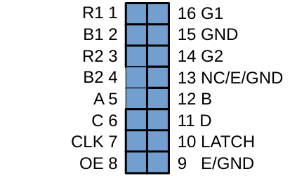

# Awtrix3 → HUB75 Port

Fork of [Blueforcer/awtrix3](https://github.com/Blueforcer/awtrix3), adapted for a custom ESP32 + HUB75 P2.5 64×32 build without buttons, buzzer, DFPlayer or battery.

## Hardware

| Komponente | Detail |
|---|---|
| Controller | ESP32 DevKit V1, 30 Pins, CH340C |
| Panel | HUB75 P2.5 64×32, 160×80 mm, 1/16 Scan, ICN2037 |
| Sensor | BME280 (I2C SDA=21, SCL=22) |
| Helligkeitssensor | GL5528 LDR (GPIO 34, 10k Pulldown) |
| Netzteil | MeanWell GST25E05-P1J 5V/4A |

## Pinbelegung HUB75 → ESP32



| Signal | HUB75 Pin | ESP32 GPIO |
|---|---|---|
| R1 | 1 | 25 |
| G1 | 16 | 26 |
| B1 | 2 | 27 |
| R2 | 3 | 14 |
| G2 | 14 | 12 |
| B2 | 4 | 13 |
| A | 5 | 23 |
| B | 12 | 19 |
| C | 6 | 5 |
| D | 11 | 17 |
| CLK | 7 | 16 |
| LAT | 10 | 4 |
| /OE | 8 | 15 |
| GND | 9, 15 | GND |

Pin 13 = NC, nicht anschließen.

## Build

Voraussetzung: [PlatformIO](https://platformio.org/)

```bash
# Kompilieren
pio run -e hub75

# Flashen
pio run -e hub75 -t upload

# Serial Monitor
pio device monitor -e hub75
```

**Build-Status (geprüft):**
```
RAM:   30.2%  (99 KB / 328 KB)
Flash: 65.7%  (1220 KB / 1856 KB)  — SUCCESS
```

## Erste Inbetriebnahme

### 1. Flashen

ESP32 per USB an den PC anschließen (Panel noch nicht anschließen).

```bash
pio run -e hub75 -t upload
```

Alternativ: [Online-Flasher](https://blueforcer.github.io/awtrix3/#/flasher) im Browser (Chrome/Edge, kein Firefox).

### 2. WLAN einrichten

Nach dem ersten Boot öffnet der ESP32 ein eigenes WLAN:

- **SSID:** `awtrix_XXXXX`
- **Passwort:** `12345678`

Damit verbinden, dann Browser öffnen und `http://192.168.4.1` aufrufen. Dort Home-WLAN-SSID und Passwort eintragen, speichern. Der ESP32 verbindet sich und zeigt die zugewiesene IP-Adresse auf dem Panel an (sobald das Panel angeschlossen ist).

### 3. Panel anschließen und in Betrieb nehmen

1. ESP32 von USB trennen
2. HUB75-Flachbandkabel anschließen (Pin 1 = roter Streifen am Kabel)
3. Stromkabel Panel (rot = +5V, schwarz = GND) an MeanWell anschließen
4. ESP32 VIN und GND über die 5V-Schiene vom MeanWell speisen
5. MeanWell einschalten — Panel zeigt kurz die IP-Adresse, dann startet die App-Schleife

**Web-UI:** `http://<angezeigte-IP>` — dort MQTT, Helligkeit, Apps konfigurieren.

> **Wichtig:** USB und MeanWell-5V niemals gleichzeitig anlegen — zwei 5V-Quellen parallel können den Spannungsregler auf dem ESP32 beschädigen.

### 4. LDR kalibrieren

Im Web-UI unter Settings oder direkt via HTTP:

```bash
curl -X POST http://<IP>/api/settings \
  -H "Content-Type: application/json" \
  -d '{"ldr_on_ground": true}'
```

Nötig weil die Schaltung (3V3 → LDR → GPIO34, 10k nach GND) zur Ulanzi-Polung invertiert ist.

## Sensor-Verdrahtung

### BME280 — Temperatur, Luftfeuchtigkeit, Luftdruck

Der GY-BME280-5V-Breakout verträgt direkt 5V und hat einen integrierten 3.3V-Regler.

```
ESP32          BME280 (GY-BME280-5V)
─────────────────────────────────────
5V-Schiene  →  VCC
GND         →  GND
GPIO 21     →  SDA
GPIO 22     →  SCL
```


---

### GL5528 LDR — Automatische Helligkeit

Spannungsteiler: Der LDR und ein 10kΩ-Widerstand teilen die 3,3V-Versorgung.
Je mehr Licht → desto geringer der LDR-Widerstand → desto höher die Spannung an GPIO 34.

```
ESP32 3V3
    │
   [LDR]  ← GL5528 Fotowiderstand
    │
GPIO 34  ──────── ADC-Eingang (10-bit, 0–1023)
    │
  [10kΩ]  ← Pull-Down nach GND
    │
   GND
```

> **Hinweis:** `ldr_on_ground: true` in den Settings setzen — diese Polung ist  
> zum Ulanzi-Original invertiert (dort sitzt der Widerstand oben, der LDR unten).


Alle technischen Entscheidungen, Capability-Macros und Port-Details: [HUB75_PORT_PLAN.md](HUB75_PORT_PLAN.md)

## Lizenz

CC BY-NC-SA 4.0 — siehe [LICENSE.md](LICENSE.md).
Original-Firmware: Copyright (C) 2024 Stephan Mühl (Blueforcer).
